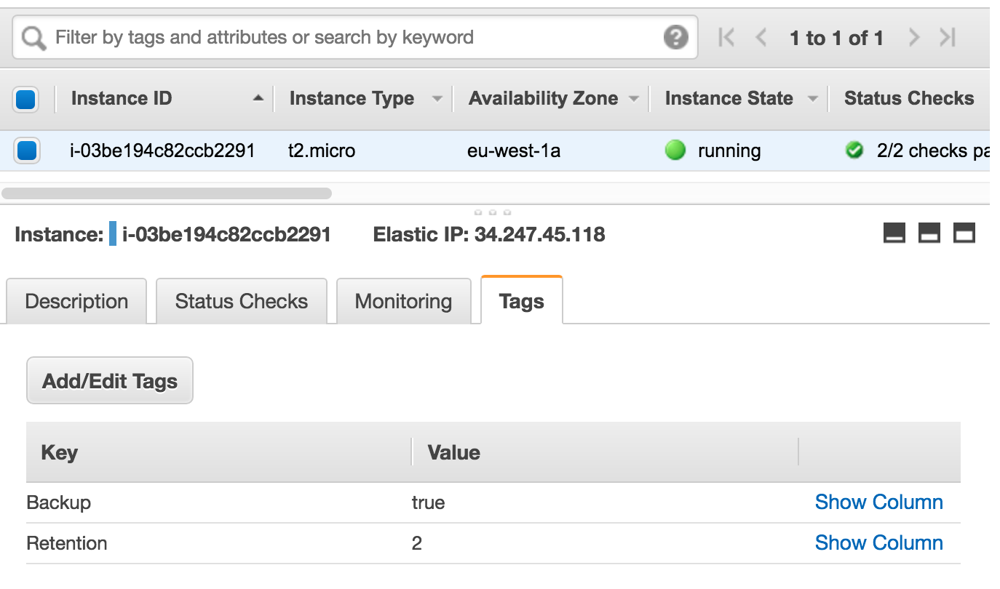
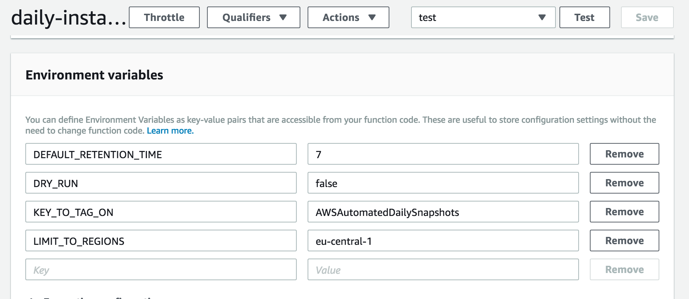

# Create Rotating Instance AMIs and Volume Backups
With serverless!

**Found at:** https://github.com/AndrewFarley/AWS-Automated-Daily-Instance-AMI-Snapshots
## Author
* Farley - farley _at_ **neonsurge** _dot_ com

## Purpose
1. A nearly idiot-proof way to begin doing automated regular snapshots across your entire AWS account for both instances AND individual volumes.
1. To promote people to back things up by giving them an easy **and** affordable way to begin doing so.
1. To try to save them money in regards to backups by deleting them after a while (7 days by default)


## What does this do...?
1. This uses the serverless framework, which deploys a Lambda to your AWS account in the eu-west-1 region (adjustable, but pointless to change)
1. This lambda is given a limited role to allow it to do only what it needs to do, no funny stuff
1. This also tells CloudWatch Events to run this automatically once a day (adjustable)
1. When this lambda runs it scans through every region...
    1. For any instances with the tag Key of "backup"
    1. If it finds any it will create a snapshot of them, preserving all the tags in the AMI (but not in the volume snapshots, see Issue #2).
    1. For any volumes with the tag Key of "backup"
    1. If it finds any, it will create a snapshot of this volume, preserving all tags from the original volume.
1. After its done taking snapshots, it will then scan through all the AMIs and snapshots that this script previously created, and will evaluate if it's time to delete those items if they are old enough.


## Prerequisites

- [Serverless Framework v1.0+](https://serverless.com/)
- [Nodejs v4.3+](https://nodejs.org/)
- [Setup your AWS credentials](https://serverless.com/framework/docs/providers/aws/guide/credentials/)

## Setup

```bash
# Make sure your CLI has a default AWS credentials setup, if not run this...
aws configure

# Clone this repository with...
git clone git@github.com:AndrewFarley/AWS-Automated-Daily-Instance-AMI-Snapshots.git
cd AWS-Automated-Daily-Instance-AMI-Snapshots

# Deploy it with...
serverless deploy

# Run it manually with...
serverless invoke --function execute_handler --log
```

Now go tag your instances or volumes (manually, or automatically if you have an automated infrastructure like [Terraform](https://www.terraform.io/) or [CloudFormation](https://aws.amazon.com/cloudformation/)) with the Key "backup" (with any value) which will trigger this script to back that instance up.

If you'd like to specify the number of days to retain backups, set the key "Retention" with a numeric value.  If you do not specify this, by default keeps the AMIs for 7 days.



After tagging some servers, try to run it manually again and check the output to see if it detected your server. To make sure your tag works, go run the lambda yourself manually and check the log output.  If you tagged some instances and it ran successfully, your output will look something like this...

```bash
bash-3.2$ serverless invoke --function execute_handler --log
--------------------------------------------------------------------
Scanning region: eu-central-1
Scanning for instances with tags (backup,Backup)
  Found 2 instances to backup...
  Instance: i-00001111222233334
      Name: jenkins-build-server
      Time: 7 days
       AMI: ami-00112233445566778
  Instance: i-55556666777788889
      Name: primary-webserver
      Time: 7 days
       AMI: ami-11223344556677889
Scanning for AMIs with tags (AWSAutomatedDailySnapshots)
  Found AMI to consider: ami-008e6cb79f78f1469
           Delete After: 06-12-2018
This item is too new, skipping...
Scanning region: eu-west-1
Scanning for instances with tags (backup,Backup)
  Found 0 instances to backup...
Scanning for AMIs with tags (AWSAutomatedDailySnapshots)
Scanning region: eu-west-2
```

### That's IT!
Now every day, once a day this lambda will run and automatically make no-downtime snapshots of your servers and/or volumes.

## Updating
If you'd like to tweak this function it's very easy to do without ever having to edit code or re-deploy it.  Simply edit the environment variables of the Lambda.  If you didn't change the region this deploys to, you should be able to [CLICK HERE](https://eu-west-1.console.aws.amazon.com/lambda/home?region=eu-west-1#/functions/daily-instance-snapshot-dev-execute_handler) and simply update any of the environment variables in the Lambda and hit save.  Seen below...



 * **DEFAULT_RETENTION_TIME** is the default number of days that it will keep backups for
 * **DRY_RUN** you only need to set to true briefly, if you want to test-run this script to see what it would do.  Warning: if you set this to true, make sure you un-set it, otherwise your lambda won't do anything.
 * **KEY_TO_TAG_ON** is the tag that this script will set on any AMI it creates.  This is what we will scan for to cleanup AMIs afterwards.  WARNING: Changing this value will cause any previous AMIs this script made to suddenly be hidden to this script, so you will need to delete yourself.
 * **LIMIT_TO_REGIONS** helps to speed this script up a lot by not wasting time scanning regions you aren't actually using.  So, if you'd like this script to speed up then set the this to the regions (comma-delimited) you wish to only scan.  Eg: us-west-1,eu-west-1.

## Scheduling Backups At Specific Start Times
If you wish to schedule the time for your AMI backups, simply edit the serverless.yml `rate` and use the cron syntax as follows.
```yaml
# Replace this line...
rate: rate(1 day)
# With this...
rate: cron(0 0 * * ? *)
```

For Reference on the cron format, see: [Amazon Lambda Scheduling with Rate or Cron](https://docs.aws.amazon.com/lambda/latest/dg/tutorial-scheduled-events-schedule-expressions.html)

**NOTE:** Keep in mind Amazon uses UTC time, so the above is at midnight in UTC, which is usually 8 hours ahead of California (PST) time for example.  If you wanted midnight in PST, you'd need to add 8 hours to this, making the line `cron(0 8 * * ? *)`

## Alternate Operation - Run Weekly, Expire After A Month
If you want to run this script in an "alternate" mode where it snapshots once a week, and expires after one month you can do this.  Please run these four commands on a freshly checked out copy of this repo, these will run on OS-X or Linux.

```sh
# First, replace our rate of once a day, to once a week on saturday
sed 's/rate(1 day)/cron(0 0 ? * SAT *)/' < serverless.yml > serverless.yml.tmp && cat serverless.yml.tmp > serverless.yml
# Second, replace our stack name, so it makes sense (and we can deploy this multiple times)
sed 's/daily-instance-snapshot/weekly-instance-snapshot/' < serverless.yml > serverless.yml.tmp && cat serverless.yml.tmp > serverless.yml
# Third, set our retention time to 30 days
sed 's/DEFAULT_RETENTION_TIME: "7"/DEFAULT_RETENTION_TIME: "30"/' < serverless.yml > serverless.yml.tmp && cat serverless.yml.tmp > serverless.yml
# Fourth, change the name of the key to tag on so we can deploy this at the same time as the daily snapshot (default) deployment
sed 's/KEY_TO_TAG_ON: "AWSAutomatedDailySnapshots"/KEY_TO_TAG_ON: "AWSAutomatedWeeklySnapshots"/' < serverless.yml > serverless.yml.tmp && cat serverless.yml.tmp > serverless.yml
```
_and yes, I know you could use in-place sed, but this works differently on OS-X_

Feel free to adjust the above to any other specifications you desire.  Some good examples might be running once a month, expire after a year, once a week expire after 6 months, once every 3 days expire after a month, etc.

## Validate AMIs with AWS CLI Commands and Filtering
To validate that images have been created you can view your AMIs section under the AWS Console in EC2.  Alternatively, you can use the following command-line example.
```sh
aws ec2 describe-images --owners self --filters "Name=tag:Backup,Values=true"  \
--query 'Images[ * ].{ID:ImageId, ImgName:Name, Owner:OwnerId, Tag:Description, CreationDate:CreationDate}' |  jq .
[
{
    "ID": "ami-123c8a43",
    "ImgName": "myserver.mydomain.com-backup-2018-07-02-09-00-34",
    "Owner": "012345678901",
    "Tag": "Automatic Daily Backup of myserver.mydomain.com from i-098765b1a132aa1b",
    "CreationDate": "2018-07-02T09:00:34.000Z"
},
 ...
```

## Notes/Warnings
**PLEASE NOTE:** This script will **NOT** restart your instances nor interrupt your servers as this may anger you or your client, and I wouldn't want to be responsible for that.  

Because of this, Amazon can't guarantee the file system integrity of the created image, but generally most backups are perfectly fine.  Almost every single one I've ever tested, of the thousands of AMIs I've made over the course of the last 8 years have been perfectly fine.  I've only had a handful of bad eggs, and if you use these backups with something like autoscaling with health checks, then any issues in AMIs should be rooted out fairly quickly (as they never get healthy).

In practice, only if you have heavy disk IO does this ever cause a problem for example on heavily loaded database servers.  For these type of servers, you are better off running a daily cronjob on them to force your database to sync to file (eg: CHECKPOINT in pgsql) and then initiating an AMI snapshot.  

If you want this, you'll have to do this yourself or scrounge the net for example scripts.


## Removal

Simple remove with the serverless remove command.  Please keep in mind any AMIs this script may have created will still be in place, you will need to delete those yourself.

```
serverless remove
```

## Changelog / Major Recent Features

* June 6, 2018  - Initial public release
* June 21, 2018 - Moved configuration to env variables, bugfix, more exception handling
* September 27, 2018 - [Bugfix, internal AWS tags prefixed with aws: caused failures, renaming those tag keys](https://github.com/AndrewFarley/AWSAutomatedDailyInstanceAMISnapshots/pull/8)
* November 26, 2018 - [Feature Snapshot Volumes added](https://github.com/AndrewFarley/AWSAutomatedDailyInstanceAMISnapshots/pull/11), thanks [@milvain](https://github.com/milvain) for the [idea](https://github.com/AndrewFarley/AWSAutomatedDailyInstanceAMISnapshots/issues/9)
* November 26, 2018 - [Feature Documentation for Weekly Snapshots ](https://github.com/AndrewFarley/AWSAutomatedDailyInstanceAMISnapshots/pull/12), thanks [@ChampionWolf](https://github.com/ChampionWolf) for the [idea](https://github.com/AndrewFarley/AWSAutomatedDailyInstanceAMISnapshots/issues/10)


## Adoption / Usage

This script is in use at a number of my clients including [OlinData](https://olindata.com), [Shake-On](https://www.shake-on.com/), [Xeelas](https://xeelas.nl) and [RVillage](https://rvillage.com), and a few others which I can not name.

If you're happily using this script somewhere for a client to make them super happy let me know so I can add a section here for shoutouts to happy customers.  +1 to open source eh?

## Support, Feedback & Questions

Please feel free to file Github bugs if you find any or suggestions for features!  If you're technically minded, please feel free to fork and make your own modifications.  If you make any fixed/changes that are awesome, please send me pull requests or patches.

If you have any questions/problems beyond that, feel free to email me at one of the emails in [author](#author) above.
